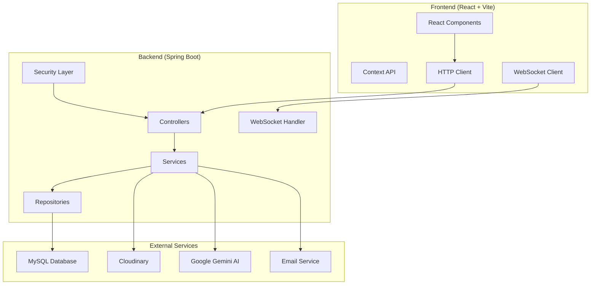

# 🍽️ Luxe Restaurant Management System

<div align="center">


*A modern, full-stack restaurant management system with AI-powered chatbot, real-time messaging, and comprehensive admin dashboard.*

[🚀 Demo](#demo) • [📖 Documentation](#documentation) • [🛠️ Installation](#installation) • [🤝 Contributing](#contributing)

</div>

---

## 📋 Table of Contents

- [✨ Features](#-features)
- [🏗️ Architecture](#️-architecture)
- [🛠️ Tech Stack](#️-tech-stack)
- [📋 Prerequisites](#-prerequisites)
- [🚀 Installation](#-installation)
- [⚙️ Configuration](#️-configuration)
- [🏃‍♂️ Running the Application](#️-running-the-application)
- [📚 API Documentation](#-api-documentation)
- [🗄️ Database Schema](#️-database-schema)
- [👥 User Roles](#-user-roles)
- [🔐 Authentication](#-authentication)
- [🤖 AI Features](#-ai-features)
- [📱 Frontend Features](#-frontend-features)
- [🔧 Development](#-development)
- [🚀 Deployment](#-deployment)
- [🐛 Troubleshooting](#-troubleshooting)
- [🤝 Contributing](#-contributing)
- [📄 License](#-license)

---

## ✨ Features

### 🎯 Core Features
- **🍽️ Menu Management** - Complete CRUD operations for dishes and categories
- **📋 Order Management** - Order processing, status tracking, and history
- **🪑 Table Reservations** - Real-time table booking system
- **👥 User Management** - Multi-role user system (Admin, Staff, Customer)
- **💰 Promotion System** - Marketing campaigns and discount management
- **📊 Analytics & Reports** - Sales analytics and business insights

### 🚀 Advanced Features
- **🤖 AI Chatbot** - Powered by Google Gemini 2.5 Flash
- **💬 Real-time Chat** - WebSocket-based messaging system
- **🌍 Multi-language Support** - Internationalization (i18n)
- **📱 Responsive Design** - Mobile-first approach with TailwindCSS
- **🔐 JWT Authentication** - Secure token-based authentication
- **☁️ Cloud Storage** - Cloudinary integration for image management
- **📧 Email Service** - Automated email notifications
- **🎯 Onboarding Tour** - Interactive user guidance

---

## 🏗️ Architecture



### 📁 Project Structure
```
luxe_restaurant/
├── 🗄️ database_schema.sql          # Complete database schema
├── 📊 database_erd_diagram.md       # Entity relationship diagram
├── 🖥️ restaurant-be/               # Backend (Spring Boot)
│   ├── 📂 src/main/java/com/luxe_restaurant/
│   │   ├── 🎮 app/                  # Application layer
│   │   │   ├── controllers/         # REST Controllers
│   │   │   ├── requests/            # Request DTOs
│   │   │   └── responses/           # Response DTOs
│   │   └── 🏢 domain/               # Domain layer
│   │       ├── configs/             # Configuration classes
│   │       ├── entities/            # JPA Entities
│   │       ├── enums/               # Enumerations
│   │       ├── repositories/        # Data repositories
│   │       └── services/            # Business services
│   └── 📋 pom.xml                   # Maven dependencies
└── 🌐 restaurant-fe/               # Frontend (React + Vite)
    ├── 📂 src/
    │   ├── admin/                   # Admin dashboard
    │   ├── components/              # Reusable components
    │   ├── context/                 # React contexts
    │   ├── Chatbot/                 # AI chatbot
    │   ├── giohang/                 # Shopping cart
    │   └── i18n/                    # Internationalization
    └── 📦 package.json              # NPM dependencies
```

---

## 🛠️ Tech Stack

### Backend
| Technology | Version | Purpose |
|------------|---------|---------|
| ☕ **Java** | 21 | Programming language |
| 🍃 **Spring Boot** | 3.5.6 | Application framework |
| 🔐 **Spring Security** | 6.x | Authentication & authorization |
| 🗄️ **Spring Data JPA** | 3.x | Data persistence |
| 🐦 **Flyway** | Latest | Database migration |
| 🤖 **Spring AI** | 1.0.0 | AI integration |
| 📝 **Swagger/OpenAPI** | 3.x | API documentation |
| 🔧 **Maven** | 3.x | Build tool |

### Frontend
| Technology | Version | Purpose |
|------------|---------|---------|
| ⚛️ **React** | 18.2.0 | UI framework |
| ⚡ **Vite** | 7.x | Build tool |
| 🎨 **TailwindCSS** | 4.x | Styling framework |
| 🌐 **Axios** | Latest | HTTP client |
| 🔌 **WebSocket** | Latest | Real-time communication |
| 🌍 **React Router** | 7.x | Client-side routing |

### Database & Services
| Service | Purpose |
|---------|---------|
| 🗄️ **MySQL** | Primary database |
| ☁️ **Cloudinary** | Image storage |
| 🤖 **Google Gemini** | AI chatbot |
| 📧 **Gmail SMTP** | Email service |

---

## 📋 Prerequisites

Before you begin, ensure you have the following installed:

- ☕ **Java Development Kit (JDK) 21+**
- 📦 **Node.js 18+ & npm**
- 🗄️ **MySQL 8.0+**
- 🔧 **Maven 3.6+**
- 🌐 **Git**

### System Requirements
- **OS**: Windows 10+, macOS 10.15+, or Linux
- **RAM**: 8GB minimum, 16GB recommended
- **Storage**: 2GB free space

---

## 🚀 Installation

### 1️⃣ Clone the Repository
```bash
git clone https://github.com/duyynguyeun/luxe_restaurant.git
cd luxe_restaurant
```

### 2️⃣ Database Setup
```sql
-- Create database
CREATE DATABASE luxe_restaurant CHARACTER SET utf8mb4 COLLATE utf8mb4_unicode_ci;

-- Import schema (optional - will be created automatically)
mysql -u root -p luxe_restaurant < database_schema.sql
```

### 3️⃣ Backend Setup
```bash
cd restaurant-be

# Install dependencies
mvn clean install -DskipTests

# Run the application
mvn spring-boot:run
```

### 4️⃣ Frontend Setup
```bash
cd restaurant-fe

# Install dependencies
npm install

# Start development server
npm run dev
```

---

## ⚙️ Configuration

### 🗄️ Database Configuration
Create `restaurant-be/src/main/resources/application-local.yaml`:
```yaml
spring:
  datasource:
    url: jdbc:mysql://localhost:3306/luxe_restaurant?useUnicode=true&characterEncoding=utf8&useSSL=false&allowPublicKeyRetrieval=true&serverTimezone=UTC
    username: ${DB_USERNAME:root}
    password: ${DB_PASSWORD:your_password}
  
  jpa:
    hibernate:
      ddl-auto: update
    show-sql: false
```

### 🌐 Frontend Configuration
Create `restaurant-fe/.env`:
```env
VITE_API_URL=http://localhost:8080
```

### 🔐 Security Configuration
Set environment variables:
```bash
# Database
export DB_USERNAME=root
export DB_PASSWORD=your_password

# JWT Secret (generate a secure key)
export JWT_SECRET=your_jwt_secret_key

# AI Service
export GEMINI_API_KEY=your_gemini_api_key

# Email Service
export EMAIL_USERNAME=your_email@gmail.com
export EMAIL_PASSWORD=your_app_password
```

---

## 🏃‍♂️ Running the Application

### Development Mode

1. **Start Backend** (Port 8080):
```bash
cd restaurant-be
mvn spring-boot:run
```

2. **Start Frontend** (Port 5173):
```bash
cd restaurant-fe
npm run dev
```

3. **Access the Application**:
   - 🌐 **Frontend**: http://localhost:5173
   - 🔧 **Backend API**: http://localhost:8080/api
   - 📚 **API Docs**: http://localhost:8080/swagger-ui.html

### Production Mode

1. **Build Frontend**:
```bash
cd restaurant-fe
npm run build
```

2. **Build Backend**:
```bash
cd restaurant-be
mvn clean package -DskipTests
```

3. **Run JAR**:
```bash
java -jar target/luxe-restaurant-0.0.1-SNAPSHOT.jar
```

---

## 📚 API Documentation

### 🔗 Swagger UI
Access interactive API documentation at: http://localhost:8080/swagger-ui.html

### 🎯 Main API Endpoints

| Endpoint | Method | Description | Auth Required |
|----------|--------|-------------|---------------|
| `/api/login` | POST | User authentication | ❌ |
| `/api/user/**` | GET/POST/PUT/DELETE | User management | ✅ |
| `/api/dish/**` | GET/POST/PUT/DELETE | Menu management | ✅ |
| `/api/orders/**` | GET/POST/PUT | Order management | ✅ |
| `/api/reservations/**` | GET/POST/PUT/DELETE | Table reservations | ✅ |
| `/api/promotion/**` | GET/POST/PUT/DELETE | Promotion management | ✅ |
| `/api/chatbot` | POST | AI chatbot interaction | ❌ |
| `/api/images` | POST | Image upload | ✅ |

### 📝 Example API Calls

**Login:**
```bash
curl -X POST http://localhost:8080/api/login \
  -H "Content-Type: application/json" \
  -d '{"email": "admin@gmail.com", "password": "123"}'
```

**Get All Dishes:**
```bash
curl -X GET http://localhost:8080/api/dish/getall \
  -H "Authorization: Bearer YOUR_JWT_TOKEN"
```

---

## 🗄️ Database Schema

The system uses a well-designed relational database with the following main entities:

- 👥 **Users** - Customer and staff accounts
- 🍽️ **Dishes** - Menu items with categories
- 📋 **Orders** - Customer orders and order details
- 🪑 **Tables** - Restaurant table management
- 📅 **Reservations** - Table booking system
- 🎁 **Promotions** - Marketing campaigns
- 📊 **Reports** - Customer feedback

For detailed schema information, see [database_erd_diagram.md](database_erd_diagram.md).

---

## 👥 User Roles

### 🔑 Default Accounts

| Role | Email | Password | Permissions |
|------|-------|----------|-------------|
| **Admin** | admin@gmail.com | 123 | Full system access |
| **Customer** | luxerestaurant2025@gmail.com | Duynguyen123# | Order, reserve, chat |

### 🎭 Role Permissions

#### 👑 **ADMIN**
- ✅ Manage all dishes and categories
- ✅ View and update all orders
- ✅ Manage table reservations
- ✅ User management (CRUD)
- ✅ Staff management
- ✅ View reports and analytics
- ✅ Manage promotions

#### 👨‍💼 **STAFF**
- ✅ View and update orders
- ✅ Manage reservations
- ✅ View customer information
- ❌ User management
- ❌ System configuration

#### 👤 **CUSTOMER**
- ✅ Browse menu and place orders
- ✅ View order history
- ✅ Make table reservations
- ✅ Use chatbot and messaging
- ✅ Submit feedback/reports
- ✅ View promotions

---

## 🔐 Authentication

### JWT Token System
- **Access Token**: 30 minutes expiry
- **Refresh Token**: 30 days expiry
- **Algorithm**: HS512
- **Storage**: LocalStorage (Frontend)

### Security Features
- 🔒 Password encryption (BCrypt)
- 🛡️ CORS protection
- 🚫 SQL injection prevention
- 🔐 Role-based access control
- 🕐 Token expiration handling

---

## 🤖 AI Features

### Chatbot Capabilities
- **🧠 Powered by**: Google Gemini 2.5 Flash
- **💬 Features**:
  - Menu recommendations
  - Order assistance
  - Restaurant information
  - Reservation help
  - Multi-language support

### Integration
```javascript
// Frontend chatbot integration
const sendMessage = async (message) => {
  const response = await axios.post('/api/chatbot', {
    message: message,
    context: 'restaurant'
  });
  return response.data;
};
```

---

## 📱 Frontend Features

### 🎨 UI/UX Features
- **📱 Responsive Design** - Mobile-first approach
- **🌙 Modern UI** - Clean, intuitive interface
- **⚡ Fast Loading** - Lazy loading and code splitting
- **🎯 Onboarding** - Interactive user tour
- **🌍 Multi-language** - Vietnamese/English support

### 🔧 Technical Features
- **⚛️ React 18** - Latest React features
- **🎣 Hooks** - Modern React patterns
- **📡 Context API** - State management
- **🔌 WebSocket** - Real-time updates
- **📊 Charts** - Data visualization
- **🎨 TailwindCSS** - Utility-first styling

---

## 🔧 Development

### 🛠️ Development Tools
```bash
# Backend hot reload
mvn spring-boot:run -Dspring-boot.run.jvmArguments="-Dspring.profiles.active=local"

# Frontend hot reload
npm run dev

# Database migrations
mvn flyway:migrate

# Run tests
mvn test
npm test
```

### 📝 Code Style
- **Backend**: Google Java Style Guide
- **Frontend**: ESLint + Prettier
- **Database**: Snake_case naming
- **API**: RESTful conventions

### 🧪 Testing
```bash
# Backend tests
mvn test

# Frontend tests
npm run test

# Integration tests
mvn verify
```

---

## 🚀 Deployment

### 🐳 Docker Deployment
```dockerfile
# Dockerfile example
FROM openjdk:21-jdk-slim
COPY target/luxe-restaurant-0.0.1-SNAPSHOT.jar app.jar
EXPOSE 8080
ENTRYPOINT ["java", "-jar", "/app.jar"]
```

### ☁️ Cloud Deployment
- **Backend**: Heroku, AWS, Google Cloud
- **Frontend**: Vercel, Netlify
- **Database**: AWS RDS, Google Cloud SQL
- **Images**: Cloudinary CDN

---

## 🐛 Troubleshooting

### Common Issues

#### 🗄️ Database Connection Error
```
Error: Access denied for user 'root'@'localhost'
```
**Solution**: Check MySQL credentials and ensure database exists.

#### 🌐 CORS Error
```
Error: CORS policy blocked
```
**Solution**: Verify CORS configuration in SecurityConfig.java.

#### 📦 Build Failures
```
Error: Maven/NPM build failed
```
**Solution**: Clear cache and reinstall dependencies.

### 🔧 Debug Commands
```bash
# Check Java version
java -version

# Check Node version
node -v

# Check MySQL connection
mysql -u root -p -e "SHOW DATABASES;"

# View application logs
tail -f logs/application.log
```

---

## 🤝 Contributing

We welcome contributions! Please follow these steps:

1. **🍴 Fork** the repository
2. **🌿 Create** a feature branch (`git checkout -b feature/amazing-feature`)
3. **💾 Commit** your changes (`git commit -m 'Add amazing feature'`)
4. **📤 Push** to the branch (`git push origin feature/amazing-feature`)
5. **🔄 Open** a Pull Request

### 📋 Contribution Guidelines
- Follow existing code style
- Add tests for new features
- Update documentation
- Ensure all tests pass

---

## 📄 License

This project is licensed under the MIT License - see the [LICENSE](LICENSE) file for details.

---

## 📞 Support

- 📧 **Email**: support@luxerestaurant.com
- 🐛 **Issues**: [GitHub Issues](https://github.com/duyynguyeun/luxe_restaurant/issues)
- 📚 **Documentation**: [Wiki](https://github.com/duyynguyeun/luxe_restaurant/wiki)

---

<div align="center">

**⭐ Star this repository if you find it helpful!**

Made with ❤️ by the Luxe Restaurant Team

</div>
